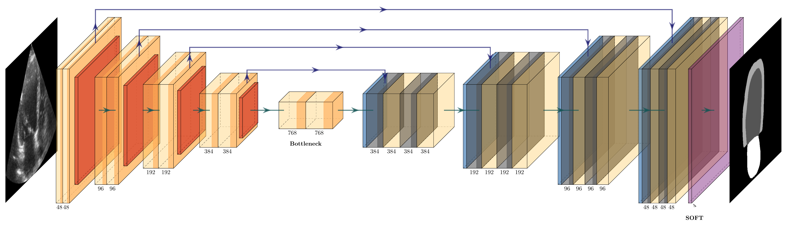

# CAMUS Segmentation: Semantic segmentation with PyTorch using an open large-scale dataset in 2D Echocardiography 

<a href="#"></a>
<a href="https://pytorch.org/"></a>


<p align="center">
  
</p>

<p align="center">
  
</p>

## Usage
    
```python
import torch
from camus_unet.camus_unet1 import CamusUnet1

if torch.cuda.is_available():
    device = torch.device('cuda')
else:
    device = torch.device('cpu')

model = CamusUnet1()  # initialise the U-NET 1 model

# move initialised model to chosen device
model = model.to(device)

# the usual training loop goes here...
```

## References
- [Deep Learning for Segmentation using an Open  Large-Scale Dataset in 2D Echocardiography](https://arxiv.org/pdf/1908.06948.pdf)
- [CAMUS project](https://www.creatis.insa-lyon.fr/Challenge/camus/)
- [CAMUS Exploratory Data Analysis](https://www.kaggle.com/code/sontungtran/camus-eda/notebook)
- [PyTorch U-Net](https://github.com/milesial/Pytorch-UNet)
- [PlotNeuralNet](https://github.com/HarisIqbal88/PlotNeuralNet)

## License
All code in this repository is under the MIT license as specified by the [LICENSE file](https://github.com/GKalliatakis/camus-segmentation-pytorch/blob/main/LICENSE).
